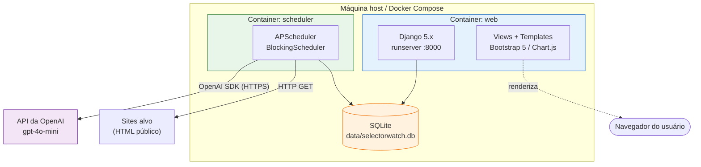
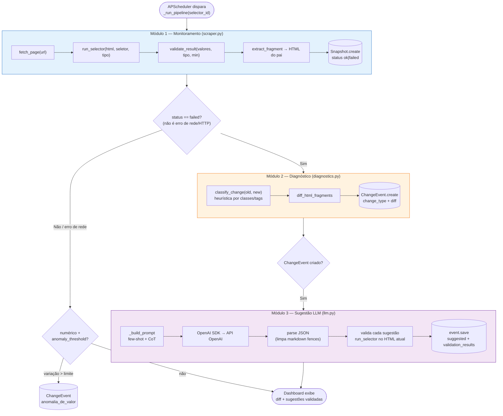
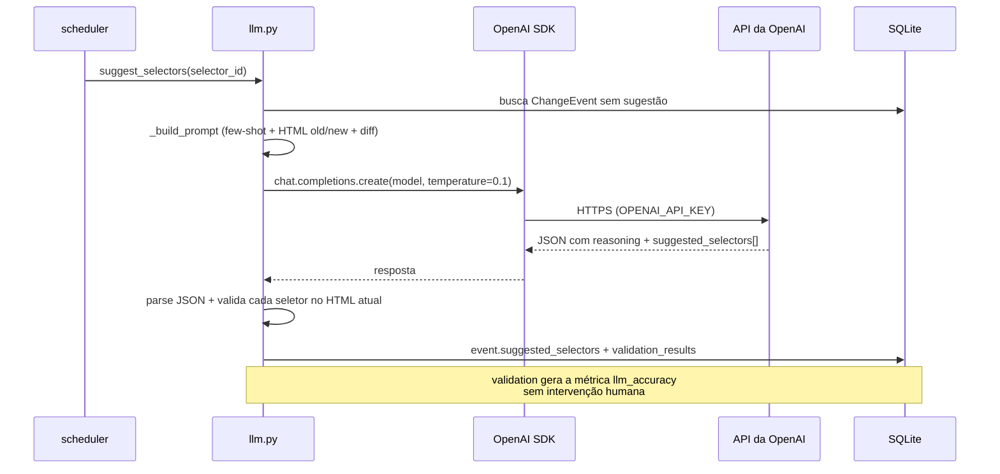
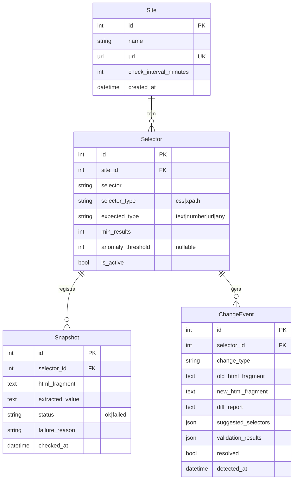
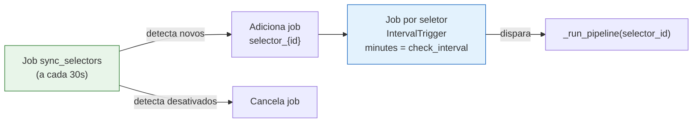

# Arquitetura do SelectorWatch

Sistema *self-healing* para seletores de web scrapers — detecção automática de falhas, diagnóstico por diff estrutural de HTML e sugestão de seletores alternativos via LLM.

TCC — Patrik Zanco — Ciência da Informação / UFSC.

---

## 1. Visão geral

O SelectorWatch monitora seletores CSS/XPath periodicamente. Quando um seletor para de funcionar (o site alterou o HTML), o sistema:

1. **Monitora** — registra snapshots de sucesso/falha de cada seletor.
2. **Diagnostica** — compara o HTML atual com o último snapshot bom (diff estrutural) e classifica o tipo de mudança.
3. **Sugere** — consulta a API da OpenAI (few-shot prompting) para propor novos seletores e os valida automaticamente contra o HTML atual.
4. **Apresenta** — dashboard web com métricas operacionais e de avaliação do protótipo.

---

## 2. Arquitetura de implantação (containers)



**Volume compartilhado:** `./data:/app/data` — o arquivo SQLite é acessível pelos dois containers. **Dependência de startup:** o `scheduler` aguarda o `web` subir (`condition: service_started`) para garantir que as migrations já foram aplicadas.

---

## 3. Stack tecnológica

| Camada | Tecnologia | Papel |
|---|---|---|
| **Backend / Web** | Python 3.11 + Django 5.x | ORM, admin, templates, migrations, servidor de desenvolvimento |
| **Banco de dados** | SQLite (via Django ORM) | Persistência (protótipo); migrável para PostgreSQL sem mudar código |
| **Scraping HTTP** | `requests` | Cliente HTTP com User-Agent realista e correção de encoding |
| **Parsing HTML** | `BeautifulSoup4` (CSS) + `lxml` (XPath) | Execução dos seletores nos dois formatos |
| **Diff / diagnóstico** | `difflib` + `BeautifulSoup4` | Diff unificado, tabela side-by-side e classificação heurística |
| **LLM** | API da OpenAI (`gpt-4o-mini`, configurável) | Sugestão de seletores via few-shot + chain-of-thought |
| **Cliente LLM** | OpenAI Python SDK | Chamada à API (tipagem, retry); `base_url` configurável |
| **Agendamento** | APScheduler (`BlockingScheduler`) | Um job por seletor + job de sincronização dinâmica |
| **Frontend** | Bootstrap 5.3 + Chart.js 4.4 (via CDN) | UI responsiva e 7 gráficos, sem build step |
| **Infraestrutura** | Docker Compose | 2 containers: `web` + `scheduler` |
| **Config** | `python-dotenv` (`.env`) | Separação de credenciais (chave OpenAI, secret Django) |

---

## 4. Os três módulos de negócio

Pipeline com responsabilidade única e sem ciclos — o fluxo vai sempre do Módulo 1 → 2 → 3.

| Módulo | Arquivo | Responsabilidade | Dependências |
|---|---|---|---|
| **1 — Monitoramento** | `monitor/scraper.py` | fetch → run_selector → validate → Snapshot | `requests`, `bs4`, `lxml` |
| **2 — Diagnóstico** | `monitor/diagnostics.py` | diff → classify → ChangeEvent | `difflib`, `bs4` |
| **3 — Sugestão LLM** | `monitor/llm.py` | prompt → OpenAI → valida sugestões | `openai`, Módulo 1 |

---

## 5. Fluxo de dados ponta a ponta



**Decisão de roteamento:** erros de rede/HTTP (sem HTML para analisar) pulam os Módulos 2 e 3 — não há fragmento para diff nem para o LLM.

---

## 6. Fluxo da sugestão via LLM (Módulo 3)



**Configuração (tudo via `.env`):** `OPENAI_API_KEY`, `OPENAI_MODEL` (default `gpt-4o-mini`), `OPENAI_BASE_URL` (opcional).

---

## 7. Modelo de dados



`Snapshot` é *append-only* (imutável). `ChangeEvent` guarda o diagnóstico completo + a resposta do LLM e a validação de cada sugestão em campos `JSONField`.

---

## 8. Scheduler — sincronização dinâmica



- **Job de sincronização:** roda a cada 30s, adiciona/remove jobs conforme os seletores ativos no banco — sem reiniciar o scheduler.
- **Job por seletor:** `IntervalTrigger` com o intervalo do site; `max_instances=1` evita sobreposição se um check demorar mais que o intervalo.

---

## 9. Métricas de avaliação (dashboard)

Computadas na `DashboardView` e exibidas via Chart.js:

| Métrica | Fórmula | Significado |
|---|---|---|
| **Recall** | `selectors_com_event / selectors_com_falha` | % de falhas detectadas que geraram diagnóstico |
| **Precisão LLM** | `sugestões_válidas / sugestões_totais` | % de seletores sugeridos que realmente funcionam |
| **Auto-recuperação** | `events_com_sugestão_válida / total_events` | % de falhas com ao menos 1 correção válida |
| **MTTR** | média de `resolved_at − detected_at` | tempo real de recuperação (vs. baseline manual de 24h) |

---

## 10. Resumo do ciclo

```
Monitorar  →  Detectar falha  →  Diagnosticar (diff)  →  Sugerir (LLM)  →  Validar  →  Apresentar
 scraper          Snapshot          diagnostics            llm.py        run_selector   dashboard
```

O que tradicionalmente é manual (perceber a falha, inspecionar o DOM, reescrever o seletor, reimplantar) passa a ser um pipeline automático com diagnóstico transparente e sugestões já validadas.
